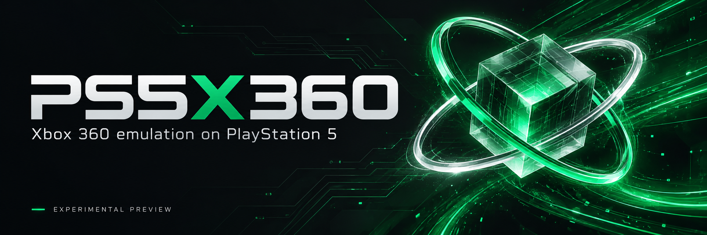
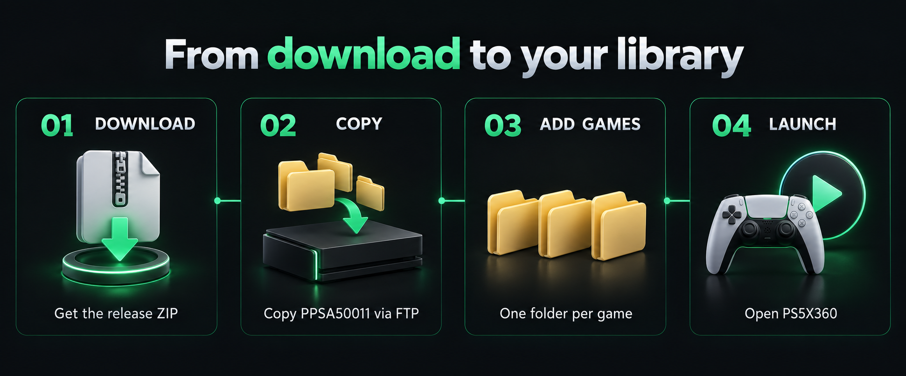

<p align="center">
  
</p>

<p align="center">
  <a href="https://github.com/BrinooTk/PS5X360/releases"><strong>Download a release</strong></a> ·
  <a href="docs/INSTALLATION.md">Installation guide</a> ·
  <a href="docs/COMPATIBILITY.md">Compatibility</a> ·
  <a href="https://github.com/BrinooTk/PS5X360/issues">Report an issue</a>
</p>

# PS5X360

An experimental **Xbox 360 emulator for PlayStation 5**, built on Xenia Canary with native DualSense input, audio output and RADV Vulkan graphics.

**Games already run on the development PS5. Compatibility varies, and this is an early preview.** Expect crashes, visual errors and uneven performance in some titles. There is no promise of full-library compatibility or 60 FPS.

## What is included

- A cover-flow game library with folders, ISO images and GOD/STFS packages.
- Player profiles, saved games and a cover downloader powered by XboxUnity.
- An in-game guide opened with the touchpad, revealing from the center outward.
- Noto Sans typography and an interface in **English, Portuguese and Spanish**.
- Automatic PS5 language detection, with **English as the interface fallback**.
- Community Xenia Canary patches, matched to the game's executable version and disabled by default.
- Optional FPS display, CAS sharpening and FSR image upscaling.
- Development v0.3.0-preview: per-game log files and configurable game folders,
  including external locations visible to the application.

## Quick installation



1. Download `PS5X360-v0.1.0-preview.zip` from [Releases](https://github.com/BrinooTk/PS5X360/releases).
2. Extract it on your computer.
3. Using FTP, copy the complete `PPSA50011` folder to **`/data/homebrew/PPSA50011`** on your PS5.
4. Let ShadowMountPlus register the title, then open **PS5X360** from the PS5 home screen.
5. Put each game in its own folder under `PPSA50011/assets/roms/`. Reopen the emulator or select **Settings → Refresh game list**.

The development setup uses **PS5 firmware 13.60 with homebrew access, etaHEN, ShadowMountPlus and kstuff**. Other setups have not been verified. This application requires an already working homebrew environment.

[Read the full installation and usage guide →](docs/INSTALLATION.md)

## Organize your games

```text
PPSA50011/
├── eboot.bin
├── sce_module/
├── sce_sys/
└── assets/
    └── roms/
        ├── Game One/
        │   ├── default.xex
        │   └── ...game data...
        ├── Game Two/
        │   └── game.iso
        └── Game Three/
            ├── ...GOD or STFS package...
            └── ...matching .data folder, if required...
```

Keep all extracted game data together. In development v0.3.0-preview, use
**Settings → Game folders** to add multiple locations, including accessible
external mounts. Earlier public builds only scan the title's `assets/roms` folder.
See the [folder configuration guide](docs/INSTALLATION.md#multiple-locations-and-external-devices-development-v030-preview).

**No games, console BIOS or keys are included.**

## Controls

| DualSense button | Library action |
| --- | --- |
| D-pad / stick | Choose a game |
| Cross | Launch |
| Triangle | Game details and patches |
| Square | Settings |
| L1 / R1 | Change library filter |
| Circle | Close the current panel |
| Touchpad, during a game | Open the emulator guide |

The guide offers resume, return to the library, Xbox BACK and exit. To use the touchpad as Xbox BACK instead, change **Settings → Touchpad click**; the guide then opens with **OPTIONS + touchpad**.

## Compatibility and bug reports

Booting into a menu is not the same as completing gameplay. Some titles still fail during scenes or fights. [Current compatibility notes](docs/COMPATIBILITY.md) distinguish console observations from host tests.

When [reporting a bug](https://github.com/BrinooTk/PS5X360/issues), include the game, title ID, region/version, enabled patches, firmware, release version and the exact point where it fails. Include a short video or screenshot and the matching game-session logs from `LOGS` (development v0.3.0-preview), or `engine.log` for older builds. The included log downloader can create a ZIP ready to share.

## Development

The active core is Xenia Canary at `b083312b8b18e07e6e410b82104191f126722794`. The PS5 core changes are stored in `patches/canary/xbox360ps5.patch`; the launcher and platform adapters live in this repository.

[Build notes and source dependencies](docs/BUILD.md) · [Third-party credits](docs/CREDITS.md)

The current release is **v0.1.0-preview**. See the [changelog](CHANGELOG.md) and
[release versioning guide](docs/RELEASING.md) for future updates.

## Support the projects

If you would like to support development of PS5X360 and my other projects,
you can contribute through [Ko-fi](https://ko-fi.com/brinoblitz).
Contributions are optional and always appreciated. Testing, bug reports and
sharing the project also help.

Older M0–M8 milestones and Portuguese research notes are preserved in [the port history](docs/PORT_HISTORY_PT.md). They describe earlier stages and do not replace the current release status.

## Credits and licenses

Based on [Xenia Canary](https://github.com/xenia-canary/xenia-canary), with the [PS5_Vulkan](https://github.com/mihawk-99/PS5_Vulkan) RADV work and native runtime/tooling from the projects listed in [Credits](docs/CREDITS.md). Community patches come from [xenia-canary/game-patches](https://github.com/xenia-canary/game-patches); covers use XboxUnity.

Original project code is licensed under MIT. Bundled third-party components keep their own licenses, including BSD, LGPL and GPL components. See [LICENSE](LICENSE), [licenses/](licenses/) and the font's [SIL Open Font License](assets/fonts/OFL.txt).

PS5X360 is an independent community project and is not affiliated with Sony or Microsoft. README artwork is illustrative branding, not an emulator screenshot.

## Latest release

**0.5.3-preview** fixes accidental game acceleration when emulated VSync is
disabled with the automatic frame limit. Guest video pacing stays at 60 Hz;
this does not guarantee 60 FPS. See [release notes](docs/releases/v0.5.3-preview.md).

The [release download](https://github.com/BrinooTk/PS5X360/releases/tag/v0.5.3-preview)
offers just **PPSA50011.zip** and the optional **AutoLog 1.0.7-preview ELF**.
Extract the ZIP and copy `PPSA50011` to `/data/homebrew/`. AutoLog is loaded separately
once per console boot; it sends diagnostic excerpts to the developer. Read its
[reporting notice and instructions](native/autolog/README.md) before enabling it.

## Automatic diagnostic reports

A separate **AutoLog ELF preview** reads game logs on the PS5 and submits them
to the preconfigured Cloudflare-to-Discord relay, without a PC collector.
Load it once per console boot after reading the reporting notice. Direct game
report delivery was verified on the owner's PS5 with firmware 13.60. Keep the
console FTP service enabled for the directory fallback; other firmware is unverified.
See [console collector instructions](native/autolog/README.md) for opt-out and
limits, or [AutoLog setup](docs/AUTOLOG.md) for the optional PC fallback.
